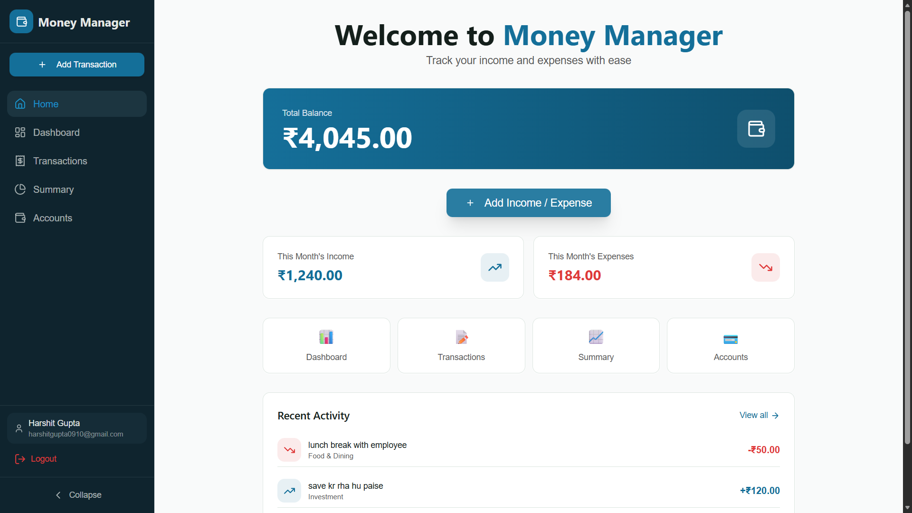

# MoneyFlow – Personal Finance & Expense Tracker



## 📌 Overview

**MoneyFlow** is a full-stack web application designed to help users efficiently manage their personal and business finances. Built during a **72-hour online full-stack hackathon challenge**, this application provides a comprehensive solution for tracking income, expenses, and analyzing spending patterns through an intuitive dashboard interface.

The application addresses the real-world problem of manual finance tracking, which is often time-consuming, error-prone, and lacks actionable insights. MoneyFlow simplifies financial management by providing structured transaction management, visual analytics, and powerful filtering capabilities.

---

## 🎯 Problem Statement

Managing income and expenses manually presents several challenges:
- **Time-consuming** – Recording transactions in spreadsheets or notebooks is inefficient
- **Error-prone** – Manual calculations increase the risk of mistakes
- **Lack of insights** – Difficult to visualize spending patterns and trends
- **No categorization** – Hard to track where money is being spent
- **Limited accessibility** – Paper-based tracking cannot be accessed anywhere

Users need a simple, web-based dashboard to track, filter, and analyze their financial data in real-time.

---

## ✅ Solution Description

MoneyFlow solves these problems by providing:
- **Dashboard-based visualization** – See your financial overview at a glance
- **Structured transaction management** – Organized income and expense tracking
- **Real-time analytics** – Instant insights into spending patterns
- **Category-wise breakdown** – Understand where your money goes
- **Account management** – Track multiple accounts and transfers
- **Smart filtering** – Filter by category, division, date range, and more
- **Edit restrictions** – Maintain data integrity with time-based edit permissions

---

## ⚡ Key Features

### Transaction Management
- ✅ Add income and expense transactions via popup modal with two tabs (Income / Expense)
- ✅ Track transactions with:
  - **Date & time** – Precise timestamp for each transaction
  - **One-line description** – Quick notes about the transaction
  - **Categories** – Fuel, Food & Dining, Medical, Loan, Movie, Investment, Salary, Business, etc.
  - **Division** – Office or Personal classification
  - **Amount** – Transaction value in INR (₹)

### Dashboard & Analytics
- ✅ View financial data by:
  - Daily income & expenditure
  - Weekly income & expenditure
  - Monthly income & expenditure
  - Yearly income & expenditure
- ✅ Total balance calculation across all accounts
- ✅ Category-wise spending summary with visual charts
- ✅ Recent activity timeline

### Advanced Filtering
- ✅ Filter transactions by:
  - **Category** (Food, Fuel, Medical, etc.)
  - **Division** (Office / Personal)
  - **Date range** (Between two specific dates)
  - **Transaction type** (Income / Expense / Transfer)

### Account Management
- ✅ Create and manage multiple accounts (Cash, Bank, Investment, etc.)
- ✅ Transfer amounts between accounts
- ✅ Real-time balance updates across all accounts
- ✅ Account-based expense tracking

### Smart Features
- ✅ **12-hour edit window** – Edit income or expense only within 12 hours of creation (restricted after that for data integrity)
- ✅ **Real-time updates** – Dashboard reflects changes immediately
- ✅ **Transaction history** – Complete log of all financial activities
- ✅ **Responsive design** – Works seamlessly on desktop and mobile devices

---

## 🛠️ Tech Stack

### Frontend
- **React.js** – Component-based UI library
- **Tailwind CSS** – Utility-first CSS framework
- **Framer Motion** – Animation library
- **Radix UI** – Accessible component primitives
- **Recharts** – Data visualization library
- **Axios** – HTTP client for API calls
- **React Router** – Client-side routing
- **Day.js** – Date manipulation library

### Backend
- **Node.js** – JavaScript runtime
- **Express.js** – Web application framework
- **MongoDB Atlas** – Cloud-hosted NoSQL database
- **Mongoose** – MongoDB object modeling
- **JWT** – Authentication & authorization
- **bcryptjs** – Password hashing

### Deployment
- **Frontend** – Vercel
- **Backend** – Render
- **Database** – MongoDB Atlas

---

## 🔄 Application Flow

1. **User Registration/Login** – Secure authentication with JWT tokens
2. **Dashboard View** – User lands on the main dashboard showing total balance and monthly summaries
3. **Add Transaction** – Click "Add Transaction" button to open modal
4. **Select Type** – Choose Income or Expense tab
5. **Fill Details** – Enter amount, description, category, division, date & time
6. **Submit** – Transaction is saved and dashboard updates in real-time
7. **View Analytics** – Access Dashboard, Summary, and Transactions pages for insights
8. **Filter Data** – Use advanced filters to analyze specific categories or date ranges
9. **Account Management** – Transfer funds between accounts or add new accounts
10. **Edit Transactions** – Modify transactions within 12 hours if needed

---

## 📸 Screenshots

### Home Dashboard


### Transaction Modal
*Add Income/Expense with categorization and timestamps*

### Analytics Dashboard
*Visual charts showing spending patterns by category and time period*

### Transaction History
*Complete filterable list of all transactions*

### Account Management
*Manage multiple accounts and transfer funds*

---

## 🌐 Live Demo

**Frontend Deployment:** [https://money-flow-fawn.vercel.app](https://money-flow-fawn.vercel.app)

**Backend API:** [https://moneyflow-ny29.onrender.com](https://moneyflow-ny29.onrender.com)

---

## 📂 Repository Links

- **Frontend Repository:** [GitHub - Frontend](https://github.com/harshitgupta0910/MoneyFlow/tree/main/frontend)
- **Backend Repository:** [GitHub - Backend](https://github.com/harshitgupta0910/MoneyFlow/tree/main/backend)

---

## 🚀 Setup Instructions

### Prerequisites
- Node.js (v16 or higher)
- npm or yarn
- MongoDB Atlas account

### Frontend Setup

1. Clone the repository:
```bash
git clone <frontend-repo-url>
cd frontend
```

2. Install dependencies:
```bash
npm install
```

3. Create `.env` file:
```env
VITE_API_URL=https://moneyflow-ny29.onrender.com/api
```

4. Start development server:
```bash
npm run dev
```

The frontend will run on `https://money-flow-fawn.vercel.app`

### Backend Setup

1. Clone the repository:
```bash
git clone <backend-repo-url>
cd backend
```

2. Install dependencies:
```bash
npm install
```

3. Create `.env` file:
```env
PORT=5000
MONGODB_URI=your_mongodb_atlas_connection_string
JWT_SECRET=your_jwt_secret_key
```

4. Start the server:
```bash
npm start
```

The backend will run on `https://moneyflow-ny29.onrender.com`

### Environment Variables

#### Frontend (.env)
```
VITE_API_URL=https://moneyflow-ny29.onrender.com/api
```

#### Backend (.env)
```
PORT=5000
MONGODB_URI=mongodb+srv://<username>:<password>@cluster.mongodb.net/moneymanager
JWT_SECRET=your_secure_random_secret_key
NODE_ENV=development
```

---

## 📦 Project Structure

### Frontend
```
frontend/
├── public/
│   └── wallet.svg
├── src/
│   ├── components/
│   │   ├── layout/
│   │   │   ├── Sidebar.jsx
│   │   │   ├── MainLayout.jsx
│   │   ├── modals/
│   │   │   ├── TransactionModal.jsx
│   │   │   ├── EditTransactionModal.jsx
│   │   └── ui/
│   ├── context/
│   │   ├── AuthContext.jsx
│   │   └── MoneyContext.jsx
│   ├── pages/
│   │   ├── HomePage.jsx
│   │   ├── DashboardPage.jsx
│   │   ├── TransactionsPage.jsx
│   │   ├── SummaryPage.jsx
│   │   ├── AccountsPage.jsx
│   │   ├── LoginPage.jsx
│   │   └── SignupPage.jsx
│   └── App.jsx
├── index.html
└── package.json
```

### Backend
```
backend/
├── controllers/
│   ├── authController.js
│   ├── transactionController.js
│   ├── accountController.js
│   └── categoryController.js
├── models/
│   ├── User.js
│   ├── Transaction.js
│   ├── Account.js
│   └── Category.js
├── routes/
│   ├── authRoutes.js
│   ├── transactionRoutes.js
│   ├── accountRoutes.js
│   └── categoryRoutes.js
├── middleware/
│   └── authMiddleware.js
├── config/
│   └── db.js
├── index.js
└── package.json
```

---

## 🎓 Hackathon Declaration

**This project was developed as part of a 72-hour online full-stack hackathon challenge.**

The code is open-source and created solely for evaluation purposes. This application demonstrates:
- Full-stack development capabilities
- RESTful API design
- Modern frontend architecture
- Database modeling and management
- Authentication and authorization
- Responsive UI/UX design
- Real-time data synchronization

All features were implemented within the hackathon timeframe, showcasing rapid development and problem-solving skills.

---

## 🤝 Contributing

Contributions are welcome! Feel free to:
- Report bugs
- Suggest new features
- Submit pull requests
- Improve documentation

---

## 📄 License

This project is licensed under the MIT License.

---

## 👨‍💻 Developer

**Harshit Gupta**  
Email: harshitgupta0910@gmail.com

---

## 🙏 Acknowledgments

- Built during a 72-hour hackathon challenge
- Inspired by the need for simple, effective financial management tools
- Thanks to all open-source libraries and frameworks used in this project

---

**⭐ If you find this project useful, please consider giving it a star!**
